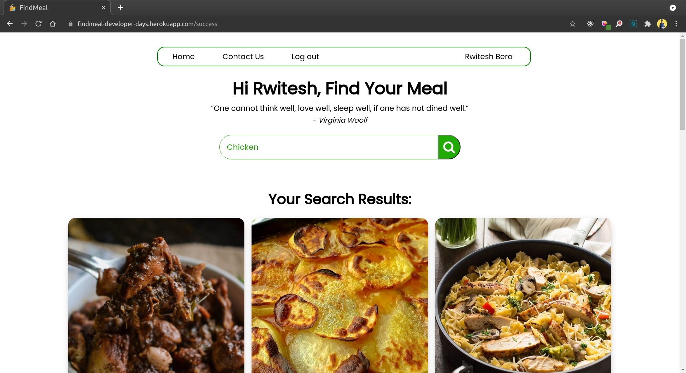
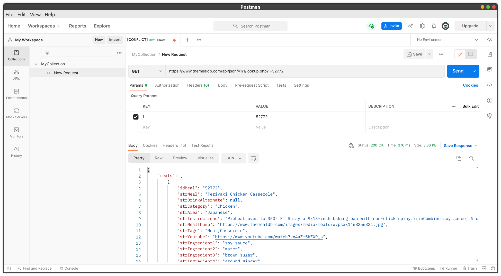

## Final Project for Developer Days
#### Project Name: FindMeal
- Webiste Link: [FindMeal](https://findmeal-developer-days.herokuapp.com/)

- Project Description: FindMeal is a web application that allows users to search for meals by ingredients. User can find recipe and watch video of the meal.
- 
- Technologies Used: HTML, CSS, JavaScript, Express.Js, MongoDB

- Added Features: SAWO Lab Authentication

- How it works:
  1. The link will redirect to login page (powered by SAWO Lab).
  2. Login by using name and email. OTP will be sent to the email.
  3. After successful login, user will be redirected to the home page.
  4. In homepage, user can search their meal in the search bar.
  5. The meal data is fetched from a third party API - [TheMealDB](https://www.themealdb.com/api.php). 
  6. There is a contact page, wher user can send message to developer. The message will be stored in MongoDB database in local machine. (MonogDB must be working locally)

#### Screenshot:

#### API Testing using POSTMAN
;